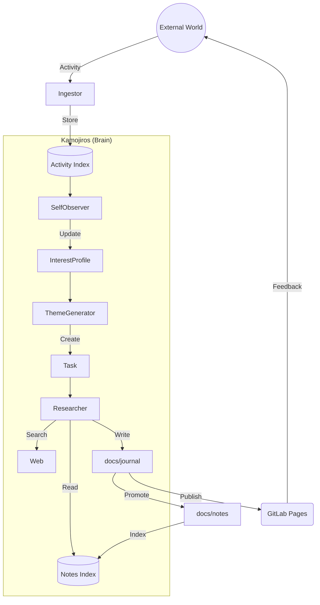

# ADR-0001: システムアーキテクチャ概観 (Second Brain)

- 日付: 2025-11-22
- ステータス: 承認
- レイヤ: architecture
- 種別: アーキテクチャ
- 関連コンポーネント: 全体

---

## 1. 背景 / コンテキスト

Kamojiros は多数のコンポーネント（収集、分析、生成、検索）から構成されていますが、全体として「何をするシステムなのか」というメンタルモデル（メタファー）を共有する必要があります。
個別の技術選定（ADR-0003〜0024）の前提となる、システム全体の振る舞いを定義します。

---

## 2. 決定

システム全体を **"Second Brain"（第二の脳）** として定義し、以下の 4 つのフェーズを循環させます。

1.  **Observation (観察)**:
    - 外部世界（Misskey, Web）からの入力を `Activity` として収集する。
    - 担当: `MisskeyIngestor`, `Kamojiroid`
2.  **Reflection (内省)**:
    - 収集した情報を整理し、興味（Interest）やタスク（Task）を更新する。
    - 担当: `SelfObserver`, `ThemeGenerator`
3.  **Research (調査)**:
    - タスクに基づいて深く調査し、知識（Report/Note）を生成する。
    - 担当: `TechResearcher`, `ReportGenerator`
4.  **Expression (表現)**:
    - 生成された知識を外部（GitLab Pages, Misskey）に出力する。
    - 担当: `Publisher`, `RepoWriter`

---

## 3. 構造図 (Conceptual)

---

## 4. 根拠（評価軸と判断）

- **Autonomy**: システムが単なるツールではなく、自律的なサイクル（OODAループに近い）を持つエージェントとして振る舞うため。
- **Separation of Concerns**: 「入力」「思考」「記憶」「出力」を明確に分けることで、各コンポーネントの責務をはっきりさせるため。

---

## 5. 関連 ADR

- ADR-0006: コアドメインモデル (Activity, Report)
- ADR-0007: 検索インデックス戦略 (Activity vs Notes)
- ADR-0002: レイヤードアーキテクチャ戦略
