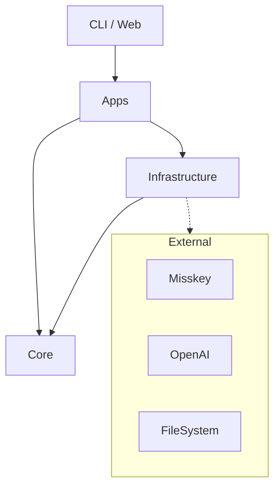

# ADR-0002: レイヤードアーキテクチャ戦略

- 日付: 2025-11-22
- ステータス: 承認
- レイヤ: architecture
- 種別: アーキテクチャ
- 関連コンポーネント: src/kamojiros/

---

## 1. 背景 / コンテキスト

Kamojiros は長期的にメンテナンスされるシステムであり、外部サービス（Misskey, OpenAI, GitLab）やフレームワーク（Pydantic AI, FastAPI）の変更に強い構造にする必要があります。

---

## 2. 決定

**Clean Architecture** に影響を受けた 4 層のレイヤードアーキテクチャを採用します。
依存の方向は **外側から内側** （Web/Apps -> Core <- Infrastructure）とします。

### レイヤ定義

1.  **Core (`src/kamojiros/core`)**:
    - **責務**: ドメインモデル、ドメインロジック、インターフェース定義（Repository Protocol）。
    - **依存**: 外部ライブラリへの依存を極力排除する（Pydantic は例外として許容）。
    - **例**: `Report`, `Activity`, `Task`, `ReportRepository(Protocol)`
2.  **Infrastructure (`src/kamojiros/infrastructure`)**:
    - **責務**: 外部システム（DB, API, FileSystem）との具体的な通信・操作。
    - **依存**: Core に依存。外部 SDK（httpx, openai, gitpython）を使用。
    - **例**: `MisskeyClient`, `MarkdownReportRepository`, `SupabaseVectorStore`
3.  **Apps (`src/kamojiros/apps`)**:
    - **責務**: ユースケース、アプリケーションロジック、エージェントの思考フロー。
    - **依存**: Core, Infrastructure に依存。エージェントフレームワーク（Pydantic AI）を使用。
    - **例**: `SelfObserver`, `ThemeGenerator`, `ReportGenerator`
4.  **Web / CLI (`src/kamojiros/web`, `src/kamojiros/cli`)**:
    - **責務**: ユーザーとの入出力（API エンドポイント、コマンドライン引数）。
    - **依存**: Apps, Core に依存。フレームワーク（FastAPI, Typer）を使用。
    - **例**: `kamojiros create`, `GET /api/reports`

---

## 3. 依存関係図

---

## 4. 根拠（評価軸と判断）

- **Testability**: Core が外部に依存しないため、単体テストが容易になる。
- **Replaceability**: 例えば「Misskey から Discord に変える」「GitLab から GitHub に変える」といった変更が Infrastructure 層の差し替えだけで済む。

---

## 5. 関連 ADR

- ADR-0004: エージェントフレームワーク (Apps 層での利用)
- ADR-0006: コアドメインモデル (Core 層)
- ADR-0015: プロジェクト構成
